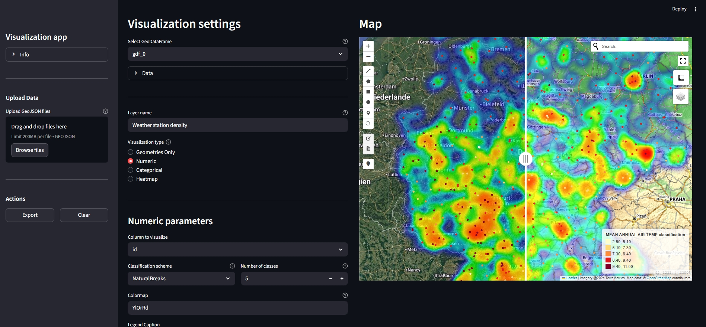

This app is developed using Spiral model–driven initial development and Scrum-driven iterative refinement, and utilizes Streamlit and GeoPandas to visualize user-provided GeoJSON files.




## Features
- Visualize spatial data 
- Export interactive maps as HTML files or as PNG images of individual layers

## Supported Formats
- GeoJSON 
            
## Visualization Types
1. Geometrical data  
- Display points, lines, or polygons

2. Numeric data 
- Choropleth maps with either discrete (classified) or continuous color scales
- For classified data: selectable classification scheme (all mapclassify schemes supported) and adjustable number of classes
- For continuous data: user-defined minimum and maximum values for the colorbar

3. . Categorical data  
- Displays distinct values from a selected column
- User-selectable Matplotlib colormap
- Optional filtering to display only specific categories

4. Heatmap  
- Visualize point density 

# How to use 
- Clone this repo
    ```
    git clone https://github.com/svenklingel/spatial-visualization-app
    ```
- Install Python >= 3.13
- Create a virtual environment
    ```
    python -m venv venv
    ```
- Activate the virtual environment
    - On Windows:
        ```
        venv\Scripts\activate
        ```
    - On macOS/Linux:
        ```
        source venv/bin/activate
        ```
- Install dependencies:
    ```
    pip install -r requirements.txt
    ```
- Run the app using the following command:
    ```
    streamlit run visualization_app.py
    ```
- Open your browser and navigate to the local URL shown in the terminal to interact with the app.

